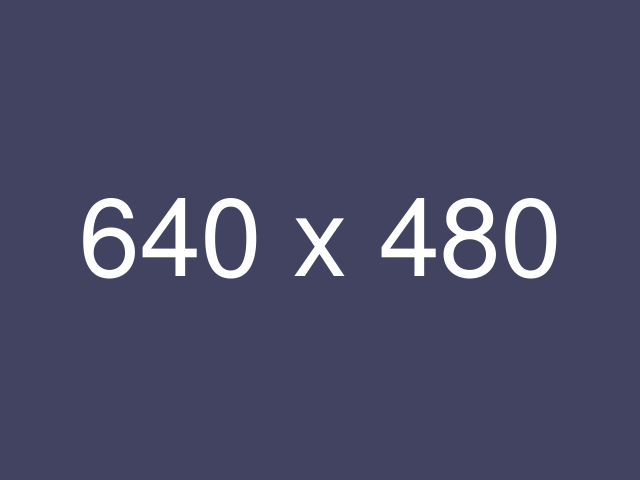

# HeaderA
## HeaderB

hello wourld  
テキスト  
*イタリック*  
**太文字**  
***太文字+イタリック***  

* NodeJS
* VSCode
* Markdown-it

1. (」・ω・)」うー！(／・ω・)／にゃー！
2. (」・ω・)」うー！(／・ω・)／にゃー！
3. (」・ω・)」うー！(／・ω・)／にゃー！
4. Let's＼(・ω・)／にゃー！

[www.google.com](https://www.google.com)

> 引用。
> 改行はダブルスペース  
> わっふるわっふる :)

```js
console.log("hello world")
```

